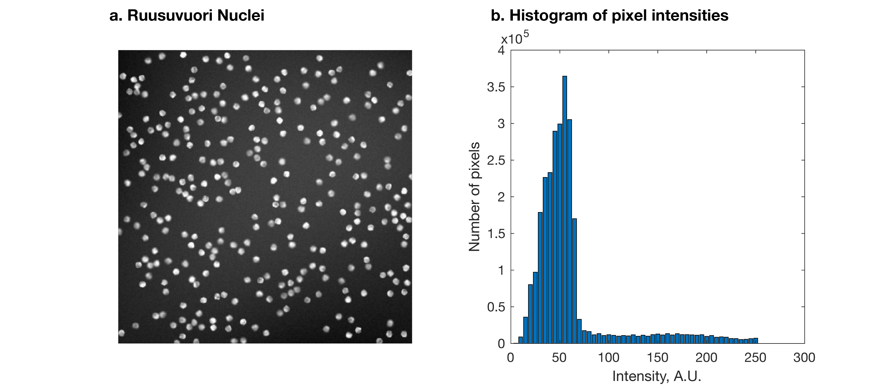
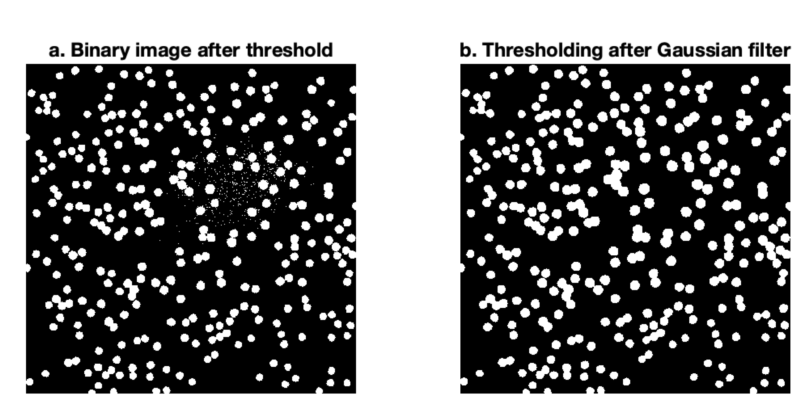
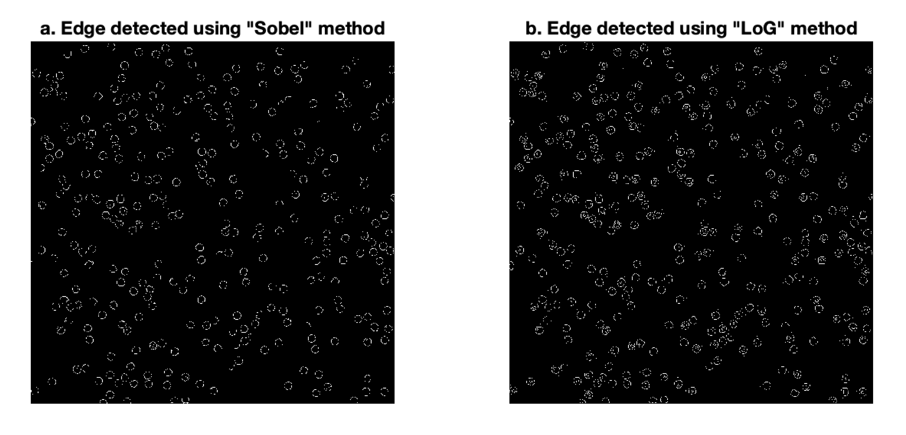
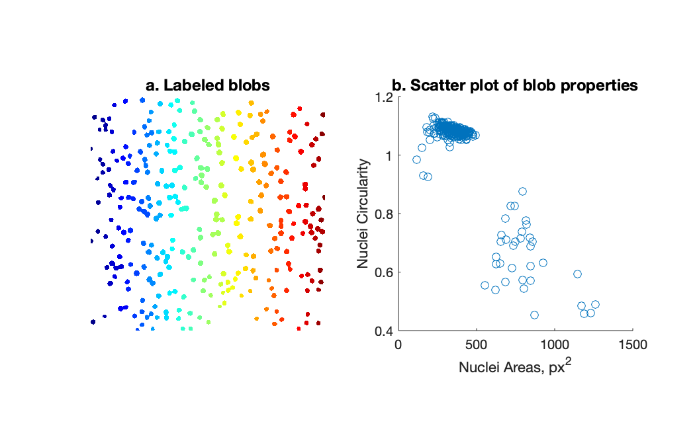
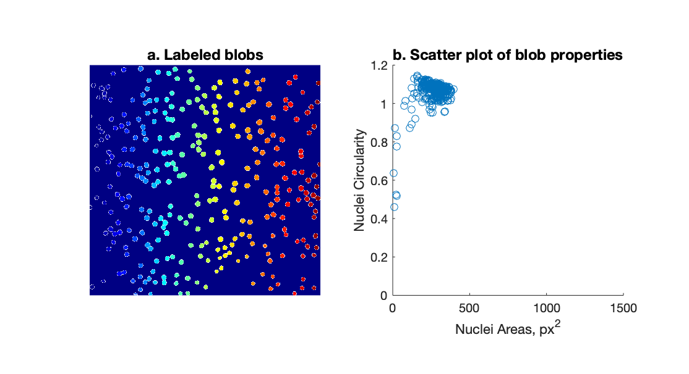

*****

#Preface
This document contains four modules that should serve both as a guide for the interested reader who wishes to learn common methods of quantitfying fluorescence microscopy and for the users of the SMART center. It represents the sum of my work when I was supported to assist the SMART center in developing didactic materials during my FFGSI appointment in Winter 2020. I hope to continue working on it to share what I have learnt about fluorescence image analysis during my PhD, and aim to create a one-stop resource for other beginners.

*Ameya Jalihal*

*January 2020*

*****

#Introduction and how to use this document
Microscopy is and has been a mainstay of modern biology. With the discovery of fluorescent proteins, genetic fusions have completely changed how we see and think about biology at microscopic scales. Advances in microscopy mean that high resolution imaging has become ubiquitous. Optical tricks allow us to get closer and closer to the diffraction limit, and post-processing tricks allow us to surpass it altogether. The result of these developments is that the intricate and complex structures that underlie life are no longer schematics on a page, and can now be visualized in their native contexts, engaged in their functions, in real time. If you are reading this document, you probably have a biological system in mind that you want to image, or have fluorescence images and are wondering what to do with them. This handbook will help you think about how you can quantify your images to learn more about your biological system.

In order for the fluorescence images to be useful they need to be subjected to some form of analysis: features need to be detected and quantified and these statistics compared and correlated across biological conditions. Quantification of fluorescence images frequently boils down to segmentation to obtain features, counting them or measuring their areas or brightness or tracking them over time. The demands of experimental rigor often necessitate analyzing large numbers of images for the sake of statistics, and in these cases it is often the most effective use of the researcher’s time to automate the operations. These operations are simultaneously trivial and complicated. They are trivial because they are highly intuitive, usually facile, if not mind-numbing tasks when performed by hand as the human brain is incredibly adept at discerning patterns in noisy, grainy or blurry images. They can be inordinately complex for the same reason: while these tasks are trivial for us to perform, it is notoriously difficult to automate these operations without a lot of fine-tuning of parameters to get the computer to look at what you are interested in. This handbook should equip you with foundational ideas related to fluorescence images so that you can start to create your own analysis pipelines. It provides several examples and presents routines written in Matlab. At the end is a list of other resources that do similar things using ImageJ and related reading.

If you plan to start performing fluorescence microscopy at the SMART center, this guide should provide you with the tools you will need to think about extracting data from your images. I recommend you start thinking about quantification in parallel to designing your experiment, because the best data comes from the best images, and computational manipulation can’t help you if your images are noisy, low resolution or have too many artefacts to begin with. I highly recommend Lee and Kitaoka’s guide to rigorous and reproducible design of fluorescence microscopy experiments listed at the end of this document. 

All images used in this handbook are obtained from Cell Image Library, which is an open-source repository of biological images. 

#Part 1: The fluorescence image and pixel intensity
A digital image is a two-dimensional matrix of *Pi*cture *El*ements or *pixels*. Each pixel in a *gray-scale* image holds a single number that corresponds to its brightness. In a 1-bit, or a *binary* image, each pixel is represented by 1 bit of information, and can take two values: 0 (black) or 1 (white). The number of gray levels or shades of grey between black and white is determined by the *data-type* of the image. So 8- or 16-bit images can have 256 or 65536 distinct gray levels. More the grey levels, the smoother a gradient from black to white looks. Each pixel in a three-color image, typically composed of red, green, and blue channels, holds three numerical values, each corresponding to the brightness of the individual *channels*. 

In the case of fluorescence images, the pixel brightness of the pixel correlates with the *fluorescence intensity* of the sample. Thus the fluorescence image can be thought of as a map of fluorescence across a microscopic field of view. Darker pixels correspond to regions in the sample that show little or no fluorescence, whereas brighter ones correspond to greater fluorescence intensity, which usually arises from a high local density of fluorophores. Quantifying the brightness of a fluorescence image therefore can give useful information about the amount of fluorescent material present in the sample and its spatial distribution. The rest of this section deals with some common operations and manipulations that can be performed to extract useful information from fluorescence images.

##Image operations and representations

Digital images are matrices, and can be manipulated in all the same ways matrices can be manipulated. A numerically-oriented programming language such as Matlab/Octave or Scilab therefore is particularly suited for image operations. Some common operations are addition, subtraction, multiplication, division, rotation, transposition and various convolution and filtering operations. The first four act at the level of individual pixels, i.e., produce a new matrix where each pixel represents the sum, difference, product or quotient of corresponding pixels in two or more images. The latter two operate on the level of the entire image matrix, therefore keep the pixel values the same but change their coordinates. 

##2D heatmaps
The most common representation of fluorescence intensity images is the 2-dimensional heatmap, where the color or brightness of each grid point on a cartesian plane corresponds to the pixel value at that location. The recorded pixel value is only related to the sum of photons collected by the camera pixel, which is related to the fluorescence emission from the sample. However, this number carries no intrinsic information related to the color of the incident light. Thus, fluorescence images are inherently greyscale images, and meta information regarding the wavelength of excitation light used, fluorophore emission characteristics and optical components such as emission filters is required to interpret the meaning of the pixel value. Further this also means that the 2D representation of fluorescence images is not tied to these experimental considerations, and various *look up tables* (LUTs) can be used to visualize images using pseudocolors that provide the best contrast, etc. ImageJ offers an array of LUT choices (<https://imagej.net/Color_Image_Processing>). Matlab has several options for colormaps that can be used in conjunction with the `imshow()` function.
```
I = imread('filename.tif');
imshow(I);
colormap('hot');
```
2D maps can also be used to represent multi-color images. Composite images where the RGB/CMYK channels each represent a different fluorophore can be used to visualize relative localizations of multiple components in a sample. Such images can be visually inspected for colocalization of features by the apparent color of pixels in the composite image. Commonly used set of colors for colocalization are

<p <span style="color:red"<span style="background-color:green">Red</span></span> <span style="color:black">+</span> <span style="color:green">Green</span> <span style="color:black">=</span> <span  style="color:yellow">Yellow</span></p>

<p <span style="color:magenta">Magenta</span> <span style="color:black">+</span> <span style="color:green">Green</span> <span style="color:black">= White</span></p>

<p <span style="color:blue">Blue</span> <span style="color:black">+</span> <span style="color:yellow">Yellow</span> <span style="color:black">= White, etc. </span></p>

While useful for quick visual inspection, using composite images with pseudocolors is discouraged due to the inability of colorblind individuals to distinguish reds from greens. It is best to also include the individual channels in addition to composite images so that the viewer unfamiliar with the images is able to make a judgement about spatial overlap independently of pseudocolor choice.

##Line plots 

While 2D heatmaps are useful to visually observe differences in localization of the fluorophore across a 2D field of view, it is sometimes necessary to visualize intensity variations across a single spatial or temporal dimension.

One way to plot intensity profiles is to plot the intensity along one of three spatial dimensions or the temporal dimension of a Z-stack or movie respectively, such as by using the indexing operation in Matlab.
```
image = imread(filename.tif')
row = 100;
plot(image(row,:));
xlabel('Pixels');
ylabel('Intensity');
```

The intensity profile along one spatial and one temporal dimension is called a kymograph, and is useful to visualize directional movement of a blob over time.

##Noise
Any contribution to pixel value that isn’t directly a readout of the “true” fluorescence intensity is noise. “Noisy” images can appear grainy or fuzzy if the pixel value of the signal is too close to the pixel value of noise. The signal:noise ratio is a good way to characterize how “sharp” an image appears, but is also a good quantitative metric to estimate the quality of your image and brightness of your signal. 
There are two categories of noise in a digital image of fluorescence: 
photon noise relates to the emission and detection of fluorescence from the sample. It follows a Poisson distribution therefore its standard deviation is related to how bright the signal is.
readout noise originates from randomness in counting photons at every pixel. It is Gaussian, therefore its standard deviation is fixed.
Knowing the functional forms of the components of noise allows us to estimate the relative contribution of each to the overall noise, subtract the background noise, and define intensity thresholds to define peaks of true signal in binary images.
Some things to remember about pixel noise are that:

1. It is random.
1. It is uncorrelated across pixels, i.e., pixel noise is independent of the value in an adjacent pixel.
1. It can deviate both positively and negatively about a mean value.

###Estimating noise
The signal-to-noise ratio (SNR) is a commonly used metric to estimate the brightness of the signal relative to the background noise. It is useful to estimate the SNR of a signal of interest when deliberating whether a given fluorophore is an appropriate choice for fluorescence labeling, to pick an intensity threshold for feature detection and many instances where quantification of fluorescence becomes important. The most common method of estimating the SNR is as follows:
Define the signal in your image: use thresholding and binary operations or manually drawn regions of interest (ROIs) to define this feature. The mean of pixel intensities within this region represents the signal.
If the selected feature, such as a cell, nucleus or other blob is relatively dispersed from other features in the field of view, an annular region of 3-10 pixels around the feature can be used to obtain the value of the background noise. The mean of pixel intensities in this region is the noise.
The SNR is the ratio of these two numbers. 
In general, an SNR >3 is required in order for the signal to be easily distinguished from the background, and higher the SNR the better.

###Artefacts: Cross talk and cross excitation
While thinking about the relationship between pixel value and fluorescence intensity, it is important to consider the various sources of variation and light-contamination in an experiment.
Fluorescence bleedthrough occurs when the sample contains a second fluorophore whose excitation spectrum overlaps with the wavelengths used to excite the first. Unless the fluorescence emission from the second fluorophore is filtered using appropriate dichroic filters, this emission light can contribute to artefacts in the image.
Common sample-independent sources of artefacts are related to misaligned lasers and dirt in the light path. These can appear as bubbles, diffraction patterns or non-uniform illumination. 
Ultimately, careful experimental design, appropriate controls and careful data acquisition can minimize undesirable artefacts in the acquired image. However there are some image features that are impossible to get rid of due to the inherent limitations of the optics. The following section describes methods to estimate and correct non-uniform background.
##Background correction
Biological fluorescence images are always dirty. Samples tend to be cloudy and the growth media they are in and glass slides they are grown on contribute to background fluorescence that can produce artefacts in the desired image or even decrease SNR. One common method to clean up an image is to use a “rolling ball” Gaussian filter. 
The Gaussian rolling ball filter subtracts the mean or median pixel intensity values in a circular area of a specified radius from the central pixel. In Matlab:

```
I = imread('filename.tif');
h = fspecial('disk',10);
filtered = imfilter(I,h,'options','replicate');
```
*****

#Part 2: Spot and other feature detection
The fluorescently-tagged molecular species will often dictate what the feature of interest in the image is. DAPI stains nuclear genomic DNA, phalloidin stains cytosolic filaments and immunofluorescence for LAMP1 stains lysosomes. Each of these appear distinct as features in an image, and requires slightly different methods for detection. Once these features are extracted, they may be quantified to measure number, size, fluorescence intensity and position relative to another feature, e.g. the number of nuclei, length of filaments, or subcellular localization of lysosomes.

The quickest method to obtain such statistics is to manually draw an ROI around the visible feature using the freehand draw tool in imageJ. While this method is neither rigorous nor time-efficient for dealing with a large number of images, it can nevertheless provide useful information about preliminary experiments. 

Algorithmic methods for feature detection fall into three categories

1. Intensity threshold-based
1. Intensity variation-based
1. Machine-learning/computer vision-based

Machine-learning based feature detection, while established and robust, often requires very large data sets to train networks on. The December 2019 Nature Collection on deep learning in microscopy and the introduction by von Chamier et al 2019 are good places to start exploring these ideas.

The two pixel intensity-based methods, however, are straightforward to implement on a wide range of fluorescence images, and can yeild highly precise quantification. Some common pipelines for such analyses are described below. 

##Intensity threshold-based methods

The basic premise of using intensity thresholds is that the feature of interest can be identified by its distinct range of fluorescence intensities. The threshold is the intensity value that reliably allows separation of pixels that belong to the feature from those that correspond to the background. In a typical fluorescence image, a histogram of pixel intensities typically has a peak at low intensities, representing the background, and a thick tail, representing the signal (Figure 1).
<center>

Figure 1: A fluorescence image of nuclei^1^ stained with DAPI (left) and a histogram of pixel intensities (right). 
</center>

Let’s consider the image of nuclei in Figure 1. The task at hand is to pick the right intensity value so that the most number of true nuclei get selected without including too many of the “dark” background pixels. This yields a binary image representing the operation `intensity > threshold`, where pixels above the threshold are assigned a value of 1 (“true”) and the rest are assigned a value of 0 (“false”). The thresholded pixels form blobs that represent nuclei (Figure 2).
<center>

Figure 2. Thresholding operations produce binary images.
</center>

ImageJ’s threshold plugin has options for several algorithms that try to estimate the background peak.  Matlab 2019, the `multithresh()` function uses the Otsu method to determine thresholds. 

Here are some considerations regarding thresholding operations for feature detection:

1. Depending on the brightness of the signal, it may or may not be possible to define a threshold that separates all true signal from the background. In this case the objective of thresholding should be to minimise false positives instead of minimizing true negatives. 
1. Filters are your friend! Use them to process raw images, to remove smooth salt-and-pepper noise or speckels (Gaussian), and non-uniform background (Tophat). Matlab’s imfilter+fspecial functions have several default kernel operations built in that are useful for image pre-processing.
1. The regions obtained from thresholding operations are only provisional. “Dilation” and “erosion” operations can be used to grow or shrink regions, and watershed operators can be used to split up large blobs. Ultimately it is up to the biology to interpret the blobs that thresholding reveals.

##Intensity variation-based methods

While thresholds are useful to detect features that look like blobs, they are less useful to detect boundaries of blobs. A straightforward way of determining edges or boundaries is using a convolution operation that looks for gradients in intensity: regions of pixels where the intensity either increases or decreases rapidly. Thus at its base, the edge detection operation is equivalent to taking the derivative of the image with respect to the intensity. The Matlab “edge” function is a simple way of obtaining edges (Figure 3). 

<center>

Figure 3. Edge detection using two different methods.
</center>

As with threshold-based blob detection, pre-processing a raw image can improve the quality of edge detection.

An extreme case in which edge detection is useful is for spot detection. Diffraction-limited imaging, such as single molecule imaging produces images where the features of interest are bright spots in a dark background. The Laplacian of Gaussian (LoG) or Mexican hat filter allows sharp variation of any kind to be amplified, resulting in a “sharper” image with respect to regions of bright signal.

Another feature of diffraction-limited spots that can be exploited to detect them is the fact that a spot's intensity profile can be approximated by a 2D Gaussian. Thus fitting each pixel to a Gaussian of defined $\sigma$ yeilds a highly accurate map of spots in an image.

##Segmentation

Once a binary image has been obtained, the next step in the pipeline is *segmentation*, the process of separating each cluster of pixels by assigning them distint values to aid downstream analysis. Matlab's `bwlabel()` function is a powerful tool that can be used to segment binary images. It assigns each cluster (or island) of white pixels a unique integer, which can be accessed individually and analyzed further (Figure 4).
```
i = imread('nuclei.tif');
thresh = multithresh(i);
blobs = bwlabel(i>thresh);
imshow(label2rgb(blobs));
```

<center>

Figure 4. Blobs colored by their unique integer labels.
</center>

Now that we have access to the blobs, we can start collecting statistics. The following code plots a scatter plot with area on the x-axis and the circularity of the blob on the y-axis, using the `regionprops()` function to extract these properties from the labeled blob image.
```
props = regionprops(blob,'Area','Circularity');
for j = 1:length(props)
    areas(j) = props(j).Area;
    circs(j)= props(j).Circularity;
end
subplot(122)
scatter(areas,circs);
axis square;
xlabel('Nuclei Areas, px^2');
ylabel('Nuclei Circularity');
```
The scatter plot tells us that the smaller blobs are almost perfectly circular, wherease the larger blobs deviate significantly from circularity. This helps us diagnose the quality of our thresholding procedure: it appears as though the automatically determined threshold isn't able to resolve nuclei that are close together, and so these larger blobs appear longer. We can us this information to refine out pipeline, by introducing a watershed step that will break up these "clumps" that the thresholding introduces.

```
bin = gb>thresh;
BW = bwlabel(bin);
D = -bwdist(~BW);
D(~BW) = -Inf;
L = watershed(D);
imshow(label2rgb(L,'jet','w'))
```
<center>

Figure 4. Watershed segmented image and corresponding scatter plot.
</center>

The scatter plot now looks more acceptable, suggesting that the watershed transform has split the previously "fused" blobs at reasonable positions that create new blobs with similar properties to the visually observable nuclei.

In general it is important to always perform sanity checks at every step of the pipeline to make sure the algorithm itself minimally impacts the data.


#Part 3: Particle tracking and diffusion analysis
Motion, at various length scales is what makes a lot of biology fascinating, and fluorescence microscopy allows us to visualize movements as tiny as those on the order of 10s of Angstroms. This section will focus on quantifying micro- to mesoscale diffusion 

#Part 4: Two color colocalization and image registration{.tabset}

#References
^1^Pekka Ruusuvuori (2011) CIL:27833. CIL. Dataset. <https://doi.org/doi:10.7295/W9CIL27833>

Waters, Jennifer C. “Accuracy and precision in quantitative fluorescence microscopy.” The Journal of cell biology vol. 185,7 (2009): 1135-48. doi:10.1083/jcb.200903097

#Other resources and outlook
Christian Tischer’s introductory talk
<https://www.ibiology.org/techniques/introduction-to-bioimage-analysis/>
...and other talks in the Bioimage Analysis series from iBiology.

Lee and Kitaoka’s excellent summary of considerations for experimental design with emphases on rigor and reproducibility:
<https://www.molbiolcell.org/doi/pdf/10.1091/mbc.E17-05-0276>

3D and confocal imaging:
<https://www.nature.com/articles/s41596-020-0313-9.pdf>

The following papers by Anne Carpenter provide both good overviews of image analysis pipelines and experimental design:

1. On the future of image analysis, with a big-picture overview of where the field is at right now: https://www.nature.com/articles/nbt.3722


##Analyzing images using ImageJ
Pete Bankhead’s book has a great introduction to file formats and other preliminaries: <https://petebankhead.gitbooks.io/imagej-intro/content/>

Robert Haase’s videos on advanced bioimage analysis using Fiji:
<https://www.youtube.com/playlist?list=PL5ESQNfM5lc7SAMstEu082ivW4BDMvd0U>

